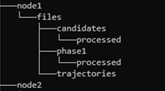

# Multi-Server or Distributed Mode

This document explains how WMPL can be run in a distributed (multi server) configuration, to allow higher data volumes to be processed. There's more information about this mode [here](WMPL_Upgrades_2026April.md). 

## Notes
* The instructions below are for a Linux-type operating system. Adapting them for Windows is left as an exercise for the reader.  
* For the purposes of this document, we will assume that WMPL is running under an account "ubuntu" on a server called "parent"and that we have a child node "node1". 
* Node names to not need to match physical machine names (though you might find it useful for keeping track / auditing). 
* Parent and children need not be on the same network, but it must be possible to connect between them using ssh and sftp. 

## Prerequisites
### At least Two Computers
You will need at least two computers with WMPL installed. Installing WMPL is covered [here](https://github.com/wmpg/WesternMeteorPyLib/README.md). 

Both Windows and Linux are supported, or a mixture of both. Child nodes can even be run under WSL2 on Windows. MacOS should also work though we have not tested it. 

#### Parent Node
One computer will be the parent node and will
- load the raw camera data to create candidate groups of observations.
- distribute candidates to any child nodes and to itself.
- solve its own workload of candidates. 
- receive any solutions uploaded by child nodes and integrate them into the solution dataset.

The parent node must have access to the raw camera data. The solved trajectories, logs and operational databases will be saved in folders on the parent node (these areas can be network shares). 

#### Child nodes
Other computers will be child nodes and will
- connect to the parent and download any assigned data
- run the solver on the candidates
- upload any successful solutions to the parent node. 

Child nodes do not need access to the raw data and do not require any long-term storage. All solved trajectories are uploaded back to the parent node and then removed from the child. Transient data on the child are housekept after a few days. 

## 1: Setup Connectivity
### 1a: Create Child Node Public Keys
Login on each child node as the account that will run WMPL *on that node* and create an SSH key, then copy it to the parent:
``` bash
ssh-keygen -t ed25519 -f ~/.ssh/wmpl -N ""
scp ~/.ssh/wmpl.pub ubuntu@parent:/tmp/node1.pub
```
You will of course have to provide the correct login details for the scp command.

### 1b: Install an SSH Server on the Parent
The parent node must have an SSH/SFTP server to allow child nodes to collect data and upload results. 

The SSH server is normally preinstalled on Linux though you may need to activate it. On Windows, you can install OpenSSH Server as explained [here](https://learn.microsoft.com/en-us/windows-server/administration/openssh/openssh_install_firstuse?tabs=gui&pivots=windows-11). 

### 1c: Create a "wmpl" Unix Group on the Parent
This group will be used to manage permissions for the child accounts on the parent node.
```bash
sudo groupadd wmpl
```

### 1d: Create Child Node Accounts and File Structure on the Parent
On the parent, create accounts and the required file structure for each child node as shown below, changing the value of NODENAME as needed

```bash
NODENAME=node1
sudo useradd $NODENAME -G wmpl
sudo mkdir -p /home/$NODENAME/files/candidates/processed
sudo mkdir -p /home/$NODENAME/files/phase1/processed
sudo mkdir -p /home/$NODENAME/files/trajectories
sudo chown $NODENAME:$NODENAME /home/$NODENAME
sudo chown -R $NODENAME:wmpl /home/$NODENAME/files
sudo chmod -R 775 /home/$NODENAME/files
```
You should end up with a structure like the one below. 



### 1e: Set Child Node ACLs on the Parent
Group permissions may not be sufficient to ensure the parent account can access the child accounts. To make certain you can apply extended ACLs to the folders as follows:
```bash
sudo setfacl -R -m user:ubuntu:rwx ~node1/files
```
replace 'ubuntu' with the account that will run WMPL on the parent. 

### 1f: Enable Sftp Logins for each Child Node on the Parent
On the parent, sudo to each child node account in turn and enable key-based logins following the example below. 
Additionally while we're still configuring things we don't want WMPL to start trying to distribute data. So we create a 'stop' file in each child's 'files' folder.

```bash
sudo su - node1
mkdir .ssh
chown $(whoami):$(whoami) .ssh
chmod 0700 .ssh
cat /tmp/$(whoami).pub >> .ssh/authorized_keys
chmod 0600 .ssh/authorized_keys

echo "stop" > ~/files/stop
```

Test that this has worked by logging into each child node, then attempting to connect to the parent with ssh:
``` bash
ssh -i ~/.ssh/wmpl node1@parent
```
Answer 'yes' if asked to accept the server key. If you get 'permission denied' check that you added the right key to the child's authorized_keys file on the parent node. 

## 2) Enable Remote Processing on the Parent
### 2a) Configure Remote Processing on the Parent
Copy `wmpl_remote.cfg.sample` to `wmpl_remote.cfg` in the WMPL working directory on the parent.  The working directory is the folder that contains the sqlite databases or legacy `processed_trajectories.json` file. 

Edit this file to ensure that the mode is `parent` and then configure one row for each child node, following the patterns shown in the sample file. See [here](WMPL_Upgrades_2026April.md) for more details on how to configure each node and for recommended capacity values, but in general each child node should be allocated capacity of no more than 200 at a time, to avoid delays in processing. 

## 2b) Start WMPL on the Parent Node
You need to run three instances of the correlator on the parent node, one in mcmode 4 to create candidate groups, one in mcmode 1 to perform local solving of candidates, and one in mcmode 2 to perform full monte-carlo solutions. Example command lines are shown below. 

``` bash
# candidate-finder node. This will continuously scan the DATADIR for potential candidate groups
python -m wmpl.Trajectory.CorrelateRMS $DATADIR --mcmode 4 --logdir $LOGDIR --dbdir $DBDIR --outdir $OUTDIR -a 4 --autofreq 15 --addlogsuffix

# local solver. This will collect candidates and attempt to solve them
python -m wmpl.Trajectory.CorrelateRMS $DATADIR --mcmode 1 --logdir $LOGDIR --dbdir $DBDIR --outdir $OUTDIR -a --autofreq 30 --addlogsuffix

# local monte-carlo phase solver. This will collect phase1 solutions and add uncertainties
python -m wmpl.Trajectory.CorrelateRMS $DATADIR --mcmode 2 --logdir $LOGDIR --dbdir $DBDIR --outdir $OUTDIR -a --autofreq 60 --addlogsuffix
```

With these options the correlator will read data from DATADIR, write trajectories to OUTDIR, write logs to LOGDIR with a suffix indicating which mode it is running in, and save the operational databases in DBDIR. 

These options also instruct the candidate-finder (mcmode 4) to run at least every 15 minutes collecting any new data from the last four days (as set by `-a 4`),  the phase-1 solver to run every 30 minutes, collecting any available data irrespective of date, and the phase-2 solver to run every 60 minutes again collecting any available data. 

The remote config file will be read from DBDIR. The file is re-loaded every time WMPL starts a new run (every 15 minutes in this example) and so you can dynamically add or remove nodes by updating the file.  Initially all nodes will be disabled because earlier we created "stop" files at step (1f) above.

## 3) Enable Remote Processing on Child Nodes
### 2a) Configure Remote Processing on the Parent
Copy `wmpl_remote.cfg.sample` to `wmpl_remote.cfg` in the WMPL working directory on the child.  The working directory is the folder that contains the sqlite databases or legacy `processed_trajectories.json` file. 

Edit this file to set mode to `child` and to configure the SFTP login details appropriately. 

## 3b) Start WMPL on the Child Node
We run only one instance of WMPL on the child node. 
```bash
# local solver. This will collect candidates and attempt to solve them then upload the results back to the parent
DATADIR=.
python -m wmpl.Trajectory.CorrelateRMS $DATADIR --mcmode 1 --logdir $LOGDIR --dbdir $DBDIR --outdir $OUTDIR -a --autofreq 15 --addlogsuffix
```
When it first starts up, the correlator will connect to the parent, remove the stop file and wait for data to be assigned to it. 
On its next pass round the parent will see that the stop file has been removed, and will assign some data to the child. 
On the child's next pass, it will collect the data, process and upload the results. 
The parent will then consolidate it into the main dataset. 

## 3c) Distributing Phase1 to Child Nodes
In the explanation above we've focused on distributing candidates so that we can quickly obtain initial (phase1) solutions. 

It is also possible to distribute phase1 solutions to child nodes which can then perform monte-carlo solutions. We do this by adding a node to the parent's remote config file, indicating that a node is in "mode 2". Then we start up a node as above, but instead of mcmode 1, we run it in mcmode 2. 
